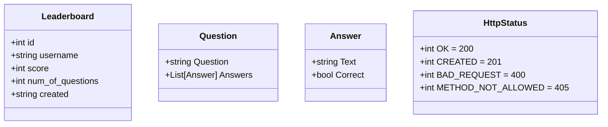
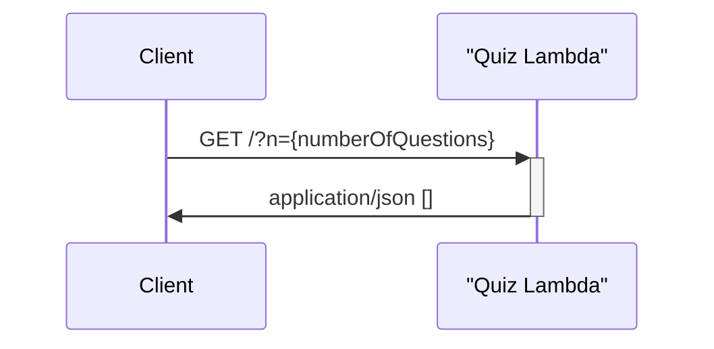
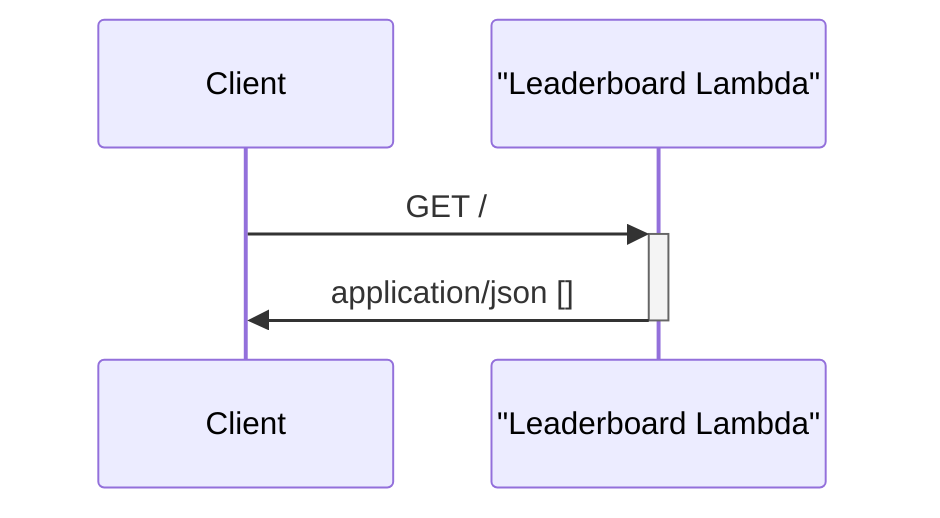
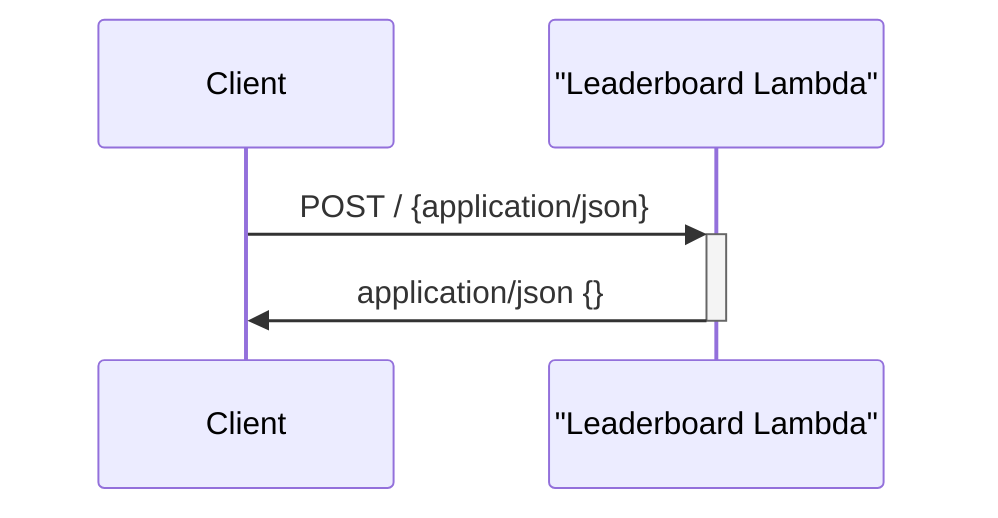
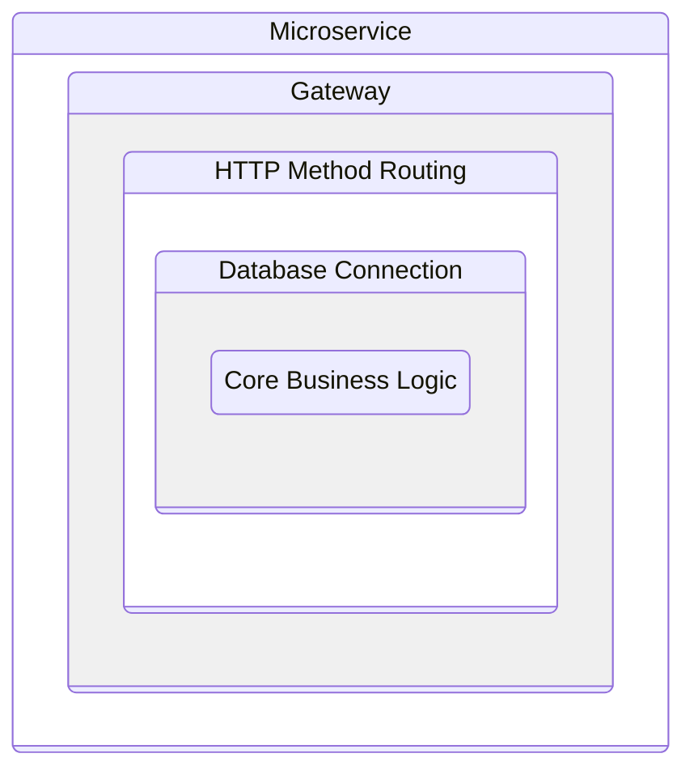
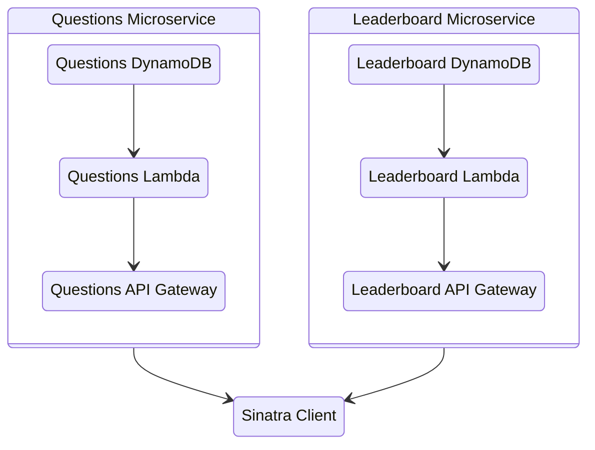
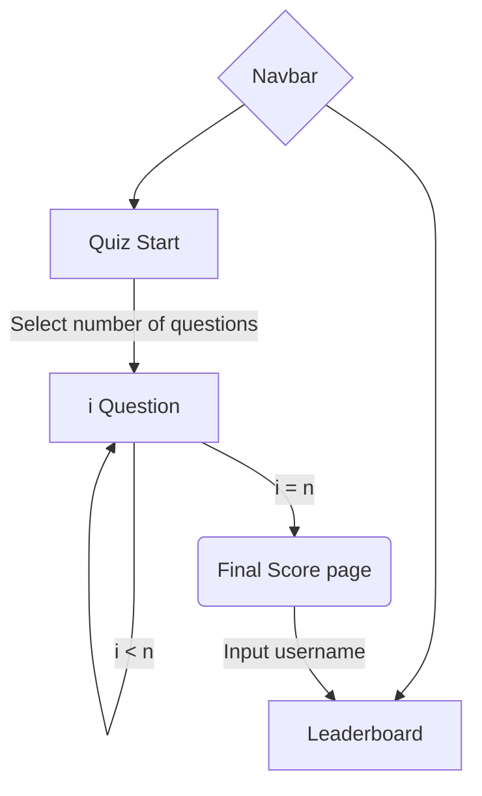

# Final Project: Quiz Application with Microservices

## General overview

The application consists of two cloud-native microservices and a client application. Everything was written in ruby 2.7.

The microservices are FaaS implementations running in the AWS Cloud and connected to their respective DynamoDB tables.

### UI/UX Design


We used Diego's Peoria css library to quickly implement a clean simple design while keeping our package size to a minimum. We took inspiration from neumorphism's principles to create a minimalist highly focused UI interface. 

#### Technical Details

The client application uses the SSR library Sinatra to handle client connections and Faraday to communicate with the backend microservices.

It uses Diego's css library Peoria to speed up development using a minimalistic clean design system

The server uses sessions to handle the user flow and url parameters to pass information from one screen to another


## How to install and run the application and all the microservices

The microservices are already up and running in the AWS cloud, but if we were to take them down, all you would need to do is:

1. Create an AWS Account
2. Go to the DynamoDB Service and Create a new table
3. Give whichever name you prefer for the Questions table
4. Go to the Lambda Service and Create a new function
5. Copy and paste the questions.rb code into the code tab
6. Click on "Add Trigger" and add an API Gateway
7. Create a new REST API gateway with an OPEN security policy
8. Take note of the URL for the Gateway you just created
9. Repeat steps 2-7 for the Leaderboard service
10. Install the sinatra and faraday gems
12. Replace the constants for the gateways with the ones you just created
11. Run the router.rb program and go to http://localhost:4567

## 4+1 architectural view model

### Logical view



### Process view







### Development view

```
front
    L leaderboard
    |   L leaderboard.aws.gateway.rb
    |   L leaderboard.interactor.rb
    L public
    |      L main.css
    L question
    |      L question.aws.gateway.rb
    |      L question.interactor.rb
    L views
    |     L error.erb
    |     L index.erb
    |     L leaderboard.erb
    |     L questions.erb
    |     L quizScore.erb
    L router.rb
    
```



### Physical view



### Scenarios (Use case view)



## Patterns used

### DSL

Sinatra creates a DSL interface that abstracts away the server logic and focuses on creating route controllers

### MVC

Sinatra follows the MVC design philosophy and implements embedded ruby for the templates.

### Iterator

Since we are working with arrays of data, we're using an implementation of the iterator pattern. We implemented a pseudo-subset of this in our quiz flow where we loop over the questions received from the gateway.

### State

The client behaves very much like a finite-state machine. it has a finite number of functions which can be accessed through the url at will

### Dependency Inyection

We use .interactor classes for our data structures to generalize the interactions and give us flexibility to adapt our code. If, for example, we wanted to migrate to another database provider, we would only need to change the dependency we send to our interactor.

### Singleton

For our gateways we use singletons since creating a new instance of the gateway would be costly and might lead to problems preserving an updated application state.

## Acknowledgments (optional)

### Ariel Ortiz :)

## References

 - https://github.com/ariel-ortiz/202211-tc3049.1/blob/main/DynamoDB/books/lambda_function.rb
 - https://refactoring.guru/design-patterns/catalog
 - https://www.scribd.com/document/84656947/Architectural-manifesto-Designing-software-architectures-Part-5
 - https://rubydoc.info/gems/sinatra
